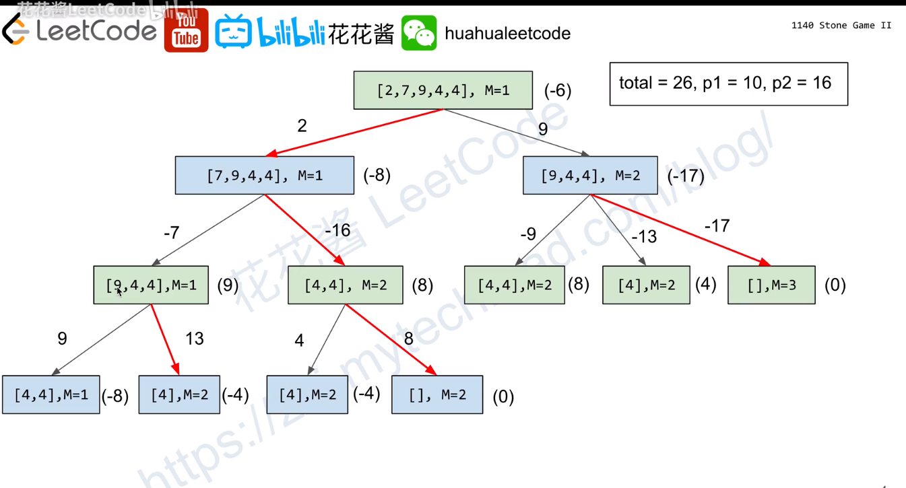

亚历克斯和李继续他们的石子游戏。许多堆石子 排成一行，每堆都有正整数颗石子 piles[i]。游戏以谁手中的石子最多来决出胜负。

亚历克斯和李轮流进行，亚历克斯先开始。最初，M = 1。

在每个玩家的回合中，该玩家可以拿走剩下的 前 X 堆的所有石子，其中 1 <= X <= 2M。然后，令 M = max(M, X)。

游戏一直持续到所有石子都被拿走。

假设亚历克斯和李都发挥出最佳水平，返回亚历克斯可以得到的最大数量的石头。

 

示例：

输入：piles = [2,7,9,4,4]
输出：10
解释：
如果亚历克斯在开始时拿走一堆石子，李拿走两堆，接着亚历克斯也拿走两堆。在这种情况下，亚历克斯可以拿到 2 + 4 + 4 = 10 颗石子。 
如果亚历克斯在开始时拿走两堆石子，那么李就可以拿走剩下全部三堆石子。在这种情况下，亚历克斯可以拿到 2 + 7 = 9 颗石子。
所以我们返回更大的 10。 


提示：

1 <= piles.length <= 100
1 <= piles[i] <= 10 ^ 4

来源：力扣（LeetCode）
链接：https://leetcode-cn.com/problems/stone-game-ii
著作权归领扣网络所有。商业转载请联系官方授权，非商业转载请注明出处。



```cpp
class Solution {
public:
    int stoneGameII(vector<int>& piles) {
        int n = piles.size();
        vector<vector<int>> cache(n, vector<int>(n + 1, INT_MIN));
        int Maxscore = score(cache, piles, 0, n, 1);
        // cout << Maxscore << "\n";
        int total = sum(piles, 0, n);
        return (total + Maxscore) / 2;
    }
    
    int score(vector<vector<int>> &cache, vector<int>& piles, int start, const int &end, int M) {
        if (start >= end)
            return 0;
        
        if (cache[start][M] > INT_MIN)
            return cache[start][M];
        if (start + 2 * M >= end) {
            return cache[start][M] = sum(piles, start, end);
        }
        
        int limit = min(start + 2 * M, end);
        int best = INT_MIN;
        int curr = 0;
        for (int i = 1; i <= 2 * M; i++) {
            curr += piles[start + i - 1];
            best = max(best, curr - score(cache, piles, start + i, end, max(i, M)));
        }
        return cache[start][M] = best;
    }
    
    int sum(vector<int>& piles, int start, int end) {
        int ret = 0;
        for (int i = start; i < end; i++) {
            ret += piles[i];
        }
        return ret;
    }
};
```

